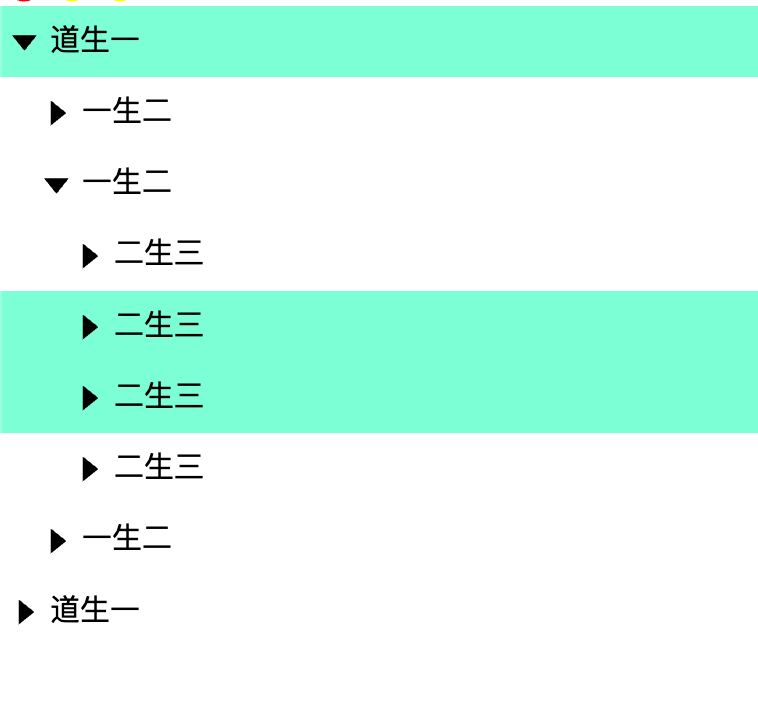

## 前置知识

### 一、TypeScript 高级语法

组件库源码 TS 用得非常深，你可能需要补这几个点：

| 关键知识                          | 用途                                |
| --------------------------------- | ----------------------------------- |
| 泛型（`<T>`）                     | 封装通用函数，如 `withInstall<T>()` |
| 交叉类型、联合类型                | 组件 props 的类型组合               |
| 条件类型 (`T extends U ? X : Y`)  | 推导组件属性、事件类型              |
| `ExtractPropTypes`, `PropType`    | 从 props 定义中生成类型             |
| 模块声明 (`declare module "vue"`) | 扩展全局组件类型                    |

👉 建议练习：自己写一版简化的 `withInstall`、`ExtractPropTypes` 示例。

---

### 二、Vue 3 底层机制

Vue 组件库源码不只是“写组件”，更多是利用底层 API。
比如：

| 知识点                                          | 示例                                |
| ----------------------------------------------- | ----------------------------------- |
| `defineOptions` / `defineProps` / `defineEmits` | setup 语法糖                        |
| `app.use()` 和 `app.component()`                | 插件注册机制                        |
| `provide/inject`                                | 全局配置共享（如主题、大小）        |
| `Teleport`, `Transition`                        | Modal、Tooltip 类组件底层依赖       |
| 运行时模板编译原理                              | 为什么 `.vue` 可以有 `setup` + 模板 |

👉 建议看下官方文档 “Vue 3 组合式 API + 插件开发” 部分，再去拆 Element Plus 的源码。

---

### 三、组件库工程化

组件库不是“写几个组件”，它是一整套工程体系：

| 模块     | 内容                          |
| -------- | ----------------------------- |
| 打包工具 | Vite + Rollup 双构建配置      |
| 按需引入 | 自动导出组件、自动注册        |
| 样式系统 | SCSS + BEM + 命名空间 + mixin |
| 类型导出 | d.ts 自动生成                 |
| 组件文档 | VitePress 集成                |
| 单元测试 | Vitest / Jest                 |

👉 建议先实现一个最小可用组件库（只有 2~3 个组件），跑通构建 → 发布 → 文档这条线。

---

### 四、源码阅读技巧

不要一上来就啃 Element Plus 这种庞然大物。
建议顺序是：

1. 看 **mini 组件库项目**（比如 `@vueuse/components`、`naive-ui` 的部分源码）；
2. 用你的组件库对照写法（例如 `withInstall`、`createNamespace`）；
3. 慢慢理解每个工具函数存在的原因。

阅读时重点不是看“写了什么”，而是问自己：

> “这个工具函数解决了什么问题？如果没有它，写组件会怎样？”

---

### ✅ 最实用的学习路径（我建议的）

1. **先理解 Vue 插件机制**（app.use + install）
2. **再学 TS 泛型与类型推导**
3. **接着写自己的 createNamespace + withInstall**
4. **最后对照 Element Plus 看差异**

---

## 搭建 monorepo 环境

monorepo 是什么？
一个产品会有多个项目，每个项目之间会存在版本同步的问题，如何在其中一个项目发布上线后，保证每个项目版本升级后的版本同步问题，提出的解决方案就是 monorepo 策略。

monorepo 是一种将多个项目代码存储在一个仓库里的软件开发策略（mono 意为单一，repo 意为 仓库）。与之相对的是另一种流行的代码管理方式 MultiRepo，即每个项目对应一个单独的仓库来分散管理。

使用 pnpm 建立 monorepo。

用 nvm 管理版本：

- 若提示没有 nvm，就先执行 export NVM_DIR="$HOME/.nvm"
  [ -s "$NVM_DIR/nvm.sh" ] && \. "$NVM_DIR/nvm.sh"
- nvm list
- nvm install
- nvm use 17：切换到 node 版本 17

## create.ts 实现 BEM 规范

BEM 命名规范：

- block 代码块、element 元素、modifier 装饰、state 状态
- `z-button` 、`z-button__element` 、`z-button__element--disable`、`is-checked`
- `:class=[bem.b('button')]`

通过 BEM 命名方式，模块层级关系简单清晰，而且 css 书写上也不必作过多的层级选择。

## SFC：单文件组件

使用 .vue 扩展名，将组件的模板、逻辑和样式封装在同一个文件中

## 组件命名

如果希望在使用组件时用`<yx-icon></yx-icon>`，那么注册时需要使用 `YxIcon`

```ts
defineOptions({
  name: "YxIcon",
});
```

```ts
// 这里添加的类型，可以在模板中被解析
declare module "vue" {
  export interface GlobalComponents {
    YxIcon: typeof Icon;
  }
}
```

## 样式

Sass：是 CSS 扩展语言，可以帮助我们减少 CSS 重复的代码，节省开发时间

文件后缀为 .scss。

浏览器并不支持 Sass 代码。因此，你需要使用一个 Sass 预处理器将 Sass 代码转换为 CSS 代码。

## 静态代码分析

ESLint 是一款用于静态代码分析的工具，可以检查 JavaScript 代码中的语法错误、风格不一致以及潜在问题

使用 Prettier 插件可以实现代码的自动格式化

## 文档

使用 vitepress

## vue 中使用 jsx、tsx

什么是 jsx：JSX 允许你在 JavaScript 中编写类似 HTML 的标签，从而使渲染的逻辑和内容可以写在一起

### 使用 jsx

1. 在 vue 文件中编写 jsx

```vue
<script>
import { ref } from "vue";

export default {
  setup() {
    const countRef = ref(1);
    const render = () => {
      return <div>Hello JSX {countRef.value}</div>;
    };
    return render;
  },
};
</script>
```

2. 在专门的.jsx 文件中编写 jsx：

```jsx
import { defineComponent } from "vue";
import Child from "./Child";

export default defineComponent({
  props: {
    name: {
      type: String,
    },
  },
  setup(props) {
    const countRef = ref(1);
    const render = () => {
      return (
        <div>
          Hello JSX {props.name} {countRef.value}
          <Child></Child>
        </div>
      );
    };
    return render;
  },
});
```

## 实现第一个组件：icon

主要思路：

- 组件定义：icon.vue + icon.ts → props + 样式 + slot
  - props 是父组件传给子组件的“配置项”或“参数”，让子组件可复用且可定制化。
- 类型封装：TS 提供类型提示和检查
- 插件包装：withInstall → 给组件加 install 方法
  - install：Vue 插件机制的核心方法。作用是告诉 Vue：当你执行 app.use(某个对象) 时，该对象应该做哪些初始化或注册。
- 整合导出：components/index.ts → 可单独 import 或全局注册
- 全局注册：main.ts 里 app.use(Icon)
- 模板使用：`<YxIcon>` 或 `<yx-icon>` → 样式 + slot 内容生效

icon.vue:

```vue
<!-- 组件实现 -->
<template>
  <i class="yx-icon" :style="style">
    <slot></slot>
  </i>
</template>

<script lang="ts" setup>
import { iconProps } from "./icon";
import { computed } from "vue";

defineOptions({
  // 给组件设置名字，以便后续全局注册
  name: "YxIcon",
});

const props = defineProps(iconProps);

const style = computed(() => {
  return {
    ...(props.size ? { fontSize: `${props.size}px` } : {}),
    ...(props.color ? { color: props.color } : {}),
  };
});
</script>
```

icon.ts：

```ts
// props定义
// 定义组件相关的属性
export const iconProps = {
  color: String,
  size: [Number, String] as PropType<number | string>,
} as const;

export type IconProps = ExtractPropTypes<typeof iconProps>;
```

components 文件夹下的 index.ts:

```ts
// 用于整合组件，最终实现导出组件
import _Icon from "./src/icon.vue";
// 给组件加一个 install 方法。安装时自动调用 app.component(name, comp) 注册为全局组件，返回带 install 的组件，既能全局注册（通过app.use）也能单独 import 使用
const Icon = withInstall(_Icon);
export default Icon;

export * from "./src/icon";

// 让 TypeScript 知道全局组件的存在，从而支持模板里自动类型推导和代码提示

// 扩展 Vue 的类型定义
declare module "vue" {
  // GlobalComponents 接口：Vue 内部用它来记录全局组件。
  export interface GlobalComponents {
    YxIcon: typeof Icon; // 告诉 TS，<YxIcon> 对应的类型就是你导出的 Icon 组件。
  }
}
```

withInstall 实现：全局注册逻辑

```ts
export type SFCWithInstall<T> = T & Plugin;

export function withInstall<T>(comp: T) {
  const c = comp as any;
  c.install = (app: App) => {
    const name = c.name || c.__name; // 取组件 name 或 __name
    if (!name) {
      console.warn("组件缺少 name，无法全局注册");
      return;
    }
    app.component(name, c); // .component() 方法：让组件在当前 Vue 应用中全局可用。
  };
  return c as SFCWithInstall<T>;
}
```

main.ts：

- 引入组件库的 Icon 组件。
- 遍历插件数组，用 app.use(plugin) 全局注册组件。
- 组件的名字取自 defineOptions({ name: 'YxIcon' })，所以在模板中可以直接 `<YxIcon>` 使用。
- 引入 scss 样式文件，让组件显示正常。

```ts
import Icon from "@yx/components/icon";
import "@yx/theme-chalk/src/index.scss";

console.log(Icon);
console.log(Icon.install);

const plugins = [Icon];

const app = createApp(App);

plugins.forEach((plugin) => {
  app.use(plugin);
}); // 注册为全局组件

app.mount("#app");
```

## 实现 tree 组件

### 处理用户传入的数据

参数：树型结构

tree.vue 中的 createOption 可以正确解析用户的自定义字段：例如将 label 定义为 xx

```vue
// App.vue
<yx-tree
  :data="data"
  label-field="xx"
  key-field="key"
  children-field="children"
></yx-tree>

// tree.vue node[labelField] // node["xx"] node[keyField] // node["key"]
node[childrenField] // node["children"]
```

### 拍平树

将树形结构拍平成 list 结构，然后用 list 来模拟树形结构。

default-expanded-keys 用于用户指定需要展开的节点 id。

使用 DFS 实现展开效果

```vue
<yx-tree
  :data="data"
  label-field="xx"
  key-field="key"
  children-field="children"
  :default-expanded-keys="['41', '4130']"
></yx-tree>
```

```js
// 把默认展开的节点做成一个 Set
const expandedKeysSet = ref(new Set(props.defaultExpandedKeys));

const flattenTree = computed(() => {
  let expandedKeys = expandedKeysSet.value; // 要展开的keys
  let flattenNodes: TreeNode[] = []; // 拍平后的结果
  const nodes = tree.value || [];
  // 倒序：保证 DFS 弹出时，顺序跟原数组一致。
  const stack: TreeNode[] = []; // 用于遍历树的栈 [40, 30,31,32, 41]

  // [40, 41]
  for (let i = nodes.length - 1; i >= 0; --i) {
    stack.push(nodes[i]);
  }
  // [41, 32, 31, 30]
  // DFS
  while (stack.length) {
    const node = stack.pop();
    if (!node) continue;
    flattenNodes.push(node);
    // 如果该节点是“展开的”，则压入子节点：
    if (expandedKeys.has(node.key)) {
      const children = node.children;
      if (children) {
        for (let i = children.length - 1; i >= 0; --i) {
          stack.push(node.children[i]);
        }
      }
    }
  }
  return flattenNodes;
});
```

### 实现点击展开

已展开集合 expandedKeysSet 里存放目前已展开的节点、子节点

父组件定义方法 toggleExpand，作用是根据传入的节点来更新已展开集合

子组件 通过 defineEmits 来获取 根据 toggleExpand 方法定义的 treeNodeEmitts，并定义 click 触发的 handleExpand 方法来触发父组件方法

```ts
// tree.ts
export const treeNodeEmitts = {
  toggle: (node: TreeNode) => node,
};
```

```js
function handleExpand() {
  emit("toggle", props.node as TreeNode);
}
```

### 实现异步加载(懒加载)

```js
// 存放正在加载的node
const loadingKeyRef = ref(new Set<Key>());

function triggerLoading(node: TreeNode) {
  // 节点需要异步加载，并且防止重复多次加载
  // 如果没有加载过这个节点，才加载
  if (!node.children.length && !node.isLeaf) {
    const loadingKey = loadingKeyRef.value;
    if (!loadingKey.has(node.key)) {
      loadingKey.add(node.key);
      const onLoad = props.onLoad;
      if (onLoad) {
        onLoad(node.rawNode).then((children) => {
          // 修改原来的节点
          node.rawNode.children = children;
          // 更新自定义的节点
          node.children = createTree(children, node);
        });
      }
    }
  }
}
```

### 实现选择节点

效果：用户点击树节点的 label 区域时，节点被选中（背景颜色高亮），也可以取消选中。默认可以多选。



实现要点：

- 点击节点的 label
- 选中/取消选中该节点
- 支持单选/多选
- 状态由外部 v-model:selected-keys 控制并保持同步

新增字段：

- selectable：可以选择节点
- multiple：可以多选节点
- selectedKeys：被选中的节点

用户使用方式：

```js
const value = ref<Key[]>([40, 41]); // 用户提供的默认选中的节点

<yx-tree
  :data="data"
  :on-load="handleLoad"
  v-model:selected-keys="value"
  selectable
  multiple
></yx-tree>
```

#### props 定义层

- tree 提供：
  - selectedKeys：外部（用户）传入的选中节点数组
  - selectable：是否允许选中
  - multiple：是否支持多选
- treeNode 接收：
  - selectedKeys：用于判断单个节点是否被选中

treeProps 新增 prop：

```ts
export const treeProps = {
  // ...
  selectedKeys: {
    type: Array as PropType<Key[]>,
  },
  selectable: {
    type: Boolean,
    default: true,
  },
  multiple: {
    type: Boolean,
    default: false,
  },
};
```

treeNodeProps 新增 prop：

```js
export const treeNodeProps = {
  // ...
  selectedKeys: {
    type: Array as PropType<Key[]>,
    default: () => [],
  },
};
```

#### 事件传递链

tree 中：

- 需求：让 tree 内部的选中状态（selectedKeysRef）始终 跟着父组件(APP)传进来的 selectedKeys prop 同步更新。由于 tree 组件只能读 props，不能改 props。所以 tree 需要一个自己的可变 state。
- 具体实现：
  - 定义响应式数据 selectedKeysRef 用于存放被选择的节点的 copy
  - watch 监视：同步外部 selectedKeys → 内部 selectedKeysRef

```js
// 选中节点
const emit = defineEmits(treeEmitts);
const selectedKeysRef = ref<Key[]>([]);
watch(
  () => props.selectedKeys,
  (value) => {
    if (value) {
      selectedKeysRef.value = value;
    }
  },
  {
    immediate: true, // 初始立即执行一次
  }
);
```

- 由 treenode 的 click 事件触发 select，来传递数据 node 给 tree 的 handleSelect：

```js
// 处理选中的节点
function handleSelect(node: TreeNode) {
  let keys = Array.from(selectedKeysRef.value);
  console.log(keys);

  if (!props.selectable) return;
  if (props.multiple) {
    // 多选：存在则移除，不存在则加入
    const index = keys.findIndex((key) => key === node.key);
    if (index > -1) {
      keys.splice(index);
    } else {
      keys.push(node.key);
    }
  } else {
    // 单选：同一个节点点击第二次会清空
    if (keys.includes(node.key)) {
      keys = [];
    } else {
      keys = [node.key];
    }
  }
  emit("update:selectedKeys", keys);
}
```

tree 新增 emit：v-model 机制 会自动监听并更新父组件(APP)的 value

```js
export const treeEmitts = {
  // v-model 同步响应式数据selectedKeys
  "update:selectedKeys": (keys: Key[]) => keys,
};
```

treenode 中为 label 标签绑定 click 事件为 handleSelected：

- 与此同时，tree 正在监听 treenode 的 select，绑定到 handleSelect(node)。

```js
<span @click="handleSelected">{{ node?.label }}</span>

function handleSelected() {
  emit("select", props.node);
}
```

treeNode 新增 emit：用于向父组件 tree 传递被 click 的 node 数据

```js
export const treeNodeEmitts = {
  // ...
  select: (node: TreeNode) => node,
};
```

#### 节点是否选中的 UI 显示

为 treenode 标签添加 isSelected 计算属性：

- 只要 props.selectedKeys 更新，节点的选中样式即可自动更新。

```js
<template>
<div :class="[bem.b(), bem.is('selected', isSelected)]"></div>
</template>

<script setup lang="ts">
const isSelected = computed(() => {
  return props.selectedKeys.includes(props.node!.key);
});
</script>
```

流程总结：

```
用户点击节点 label
        ↓
触发 treenode 的 @click="handleSelected"
        ↓
treeNode：emit("select", node)
        ↓
tree 通过 select 接收到node数据，执行handleSelect(node)
        ↓
修改 keys → emit("update:selectedKeys", keys)
        ↓
外部 v-model: 父组件APP中的 selected-keys 更新 为tree传来的keys
        ↓
tree 的 watch 检测到selectedKeys改变 → selectedKeysRef 更新
        ↓
selectedKeys 通过 prop 从 tree 传回 treeNode
        ↓
计算属性 isSelected 自动更新 → UI 高亮
```

### 实现禁用节点

新增字段：disabled

修改 handleSelected：

```js
function handleSelected() {
  if (props.node?.disabled) return;
  emit("select", props.node!);
}
```

### 实现自定义显示内容

需求：用户可以通过 slot 传递需要自定义显示的内容

例如：

```js
<yx-tree
  :data="data"
  :on-load="handleLoad"
  v-model:selected-keys="value"
  selectable
  multiple
>
  <template #default="{ node }"> {{ node.key }} - {{ node.label }} </template>
</yx-tree>
```

由于 treenode 不是 tree 的直接子组件，所以不能把 slot 直接传给 tree-node

思路：provide & inject 实现跨级传递

- tree 把插槽函数通过 provide 传给所有 TreeNode
- TreeNode 用一个 TSX 组件调这个 slot 函数

tree 组件 provide 提供 slots 给子孙组件

```js
provide(treeInjectKey, {
  slots: useSlots(), // 获取当前组件（tree）的所有插槽。
});
```

treenode 使用一个组件来渲染 slot

```js
<span :class="bem.e('label')" @click="handleSelected">
  <YxTreeNodeContent :node="node"></YxTreeNodeContent>
</span>
```

在单独的 tsx 文件定义：YxTreeNodeContent

- 通过 inject 拿到 tree 提供的 slots
- 取出用户传来的 default slot
- 调用这个 slot 函数，并传入 node 作为参数
- 若用户没传入 slot，则 fallback 为 node.label

```tsx
export default defineComponent({
  name: "YxTreeNodeContent",
  props: treeNodeContentProps,
  setup(props) {
    const treeContext = inject(treeInjectKey);
    const node = props.node;
    // console.log(node);
    return () => {
      return treeContext?.slots.default
        ? treeContext?.slots.default({ node }) // 用户自定义内容
        : node?.label;
    };
  },
});
```

类型定义：

- TreeContext：定义“Tree 要传给 TreeNode 的数据”，即 Tree 组件的 slots（即父组件传入的自定义节点渲染）
- treeInjectKey：提供一个唯一 key，使 TreeNode 能安全获取 Tree 组件传下来的 slot
- treeNodeContentProps：定义 YxTreeNodeContent 组件接受的 props：必须是 TreeNode 对象

```ts
export interface TreeContext {
  slots: SetupContext["slots"];
  // emit: SetupContext<typeof treeEmitts>["emit"];
}

export const treeInjectKey: InjectionKey<TreeContext> = Symbol();

export const treeNodeContentProps = {
  node: {
    type: Object as PropType<TreeNode>,
    required: true,
  },
};
```

总结：父组件传入 slot → Tree provide → TreeNode 通过 YxTreeNodeContent 注入 → YxTreeNodeContent 负责 inject 与渲染

### 实现树的虚拟滚动

```ts
<yx-virtual-list :items="flattenTree" :remain="8" :size="35">
  <template #default="{ node }">
    <yx-tree-node
      :key="node.key"
      :node="node"
      :expanded="isExpanded(node)"
      :loadingKeys="loadingKeyRef"
      @toggle="toggleExpand"
      :selectedKeys="selectedKeysRef"
      @select="handleSelect"
    ></yx-tree-node>
  </template>
</yx-virtual-list>
```

#### 实现 VirtualList 组件

在 virtaul.tsx 中定义 VirtualList 组件

### 实现 checkbox 组件

需求：

- 支持用户设置初始值是半选、禁用状态

```vue
<yx-checkbox
  v-model="check"
  :disabled="true"
  :indeterminate="true"
></yx-checkbox>
```

注意节点被 disabled 时，checkbox 也要 disabled

### 实现树组件级联选择

需求：

- 支持点击父节点，实现子节点全选
- 点击子节点也可改变父节点状态

```js
function toggle(node: TreeNode, checked: boolean) {
  const checkedKeys = checkedKeysRefs.value;
  if (checked) {
    // 选中的时候去掉半选状态
    indeterminateRef.value.delete(node.key);
  }
  checkedKeys[checked ? "add" : "delete"](node.key);
  const children = node.children;
  if (children) {
    children.forEach((childNode) => {
      if (!childNode.disabled) {
        toggle(childNode, checked);
      }
    });
  }
}
// 实现点击父节点的checkbox时会全选子节点的checkbox
function toggleCheck(node: TreeNode, checked: boolean) {
  toggle(node, checked);
}
```

## 实现 button 组件

- 组件属性：
  - 组件的大小 size、颜色展现类型 type、圆角 round、正在加载 loading、禁用 disabled、原始类型 native-type
- 插槽
- 功能：清空输入框、密码的显示与隐藏

## 实现 input 组件

属性：

- type：默认是 text
- modelValue： v-model = modelValue + @update:modelValue
- placeholder 默认展示的内容
- clearable：清空输入框的内容
- show-password
- readonly
- label

### 实现受控组件的 v-model 双向绑定

数据流：用户输入触发原生 input 事件 → 子组件 emit → 父组件 username 变化 → 子组件 props.modelValue 变化 → watcher → 再写回原生 input

```vue
<!-- App.vue -->
<yx-input v-model="username">
```

1. yx-input 组件：

- 接收到一个名为 modelValue 的 prop，值就是父组件的 username
- 当子组件触发 emit("update:modelValue", value) 时，父组件自动更新 username

Vue 会自动把 `v-model="username"`转换成：

```vue
<yx-input
:modelValue="username"
@update:modelValue="username = $event"
>
```

2. 组件接收 modelValue，并把它同步到原生 input 的 value

2.1 监听 props.modelValue

父组件修改 username → 子组件的 props.modelValue 更新 → watcher 触发：

```vue
<script lang="js" setup>
// 监控value值的变化
watch(
  () => props.modelValue,
  () => {
    setNativeInputValue();
  }
);
</script>
```

2.2 写入原生 `<input>` 的 value

原因是没有用 :value="modelValue"，而是手动管理 input.value，所以要显式写入

```vue
const input = ref<HTMLInputElement | null>(null);

const setNativeInputValue = () => {
  const inputEle = input.value;
  if (!inputEle) {
    return;
  }
  inputEle.value = String(props.modelValue);
};

onMounted(() => {
  setNativeInputValue();
});
</script>
```

3. 用户输入时向父组件派发事件

原生 `<input>` 监听了 input 事件：

```vue
<input
  type="text"
  v-bind="attrs"
  :class="bem.e('inner')"
  ref="input"
  @input="handelInput"
/>
```

```vue
<script lang="js" setup>
const handelInput = (e: Event) => {
  const value = (e.target as HTMLInputElement).value;
  emit("input", value);
  emit("update:modelValue", value);  // 触发 v-model 更新父组件 username
};
</script>
```

## 实现 form 组件

form由多个form-item组成。

form-item的属性：

- prop
- label 输入框的标题
- rules 表单输入的框的规则
- show-message 是否显示错误
- change、blur

校验功能：

- 支持用户传入规则到rules
- 支持单个form-item校验
- 支持校验整个form（点击按钮）


| 组件             |           职责           |
| ---------------- | :----------------------: |
| `<yx-input>`     |    负责输入与触发事件    |
| `<yx-form-item>` | 负责规则处理与单字段校验 |
| `<yx-form>`      |  负责整体数据与整体校验  |


### 实现校验功能

#### 将校验规则 rules 跨级传递给 input 组件：provide & inject

用户传入规则：

```vue
<yx-form-item
  prop="username"
  :rules="[
    { required: true, message: '请输入用户名', trigger: 'blur' },
    { min: 6, max: 10, message: '用户名6-10位', trigger: ['change', 'blur'] },
  ]"
>
  <yx-input placeholder="请输入用户名" v-model="state.username"></yx-input>
</yx-form-item>
```

父组件 from-item provide：

```vue
// from-item.vue
<script setup lang="ts">
const validate: FormItemContext["validate"] = async (trigger, callback?) => {
  // 拿到触发的时机(blur、change...)，校验是否通过可以调用 callback 或者调用promise.then方法
};

const context: FormItemContext = {
  ...props,
  validate,
};

provide(formItemContextKeys, context);
</script>
```

定义formItemContextKeys，收集 FormItem 的核心属性：

```ts
// from-item.ts
export interface FormItemContext extends FormItemProps {
  // 供input调用
  validate: (
    trigger: string,
    callback?: (isValid: boolean) => void
  ) => Promise<void>;
}

export const formItemContextKeys: InjectionKey<FormItemProps> = Symbol();
```

子组件 inject FormItem提供的上下文：

```ts
// input.vue
const formItemContext = inject(formItemContextKeys);
```

这样 input 可以在输入值更新时，调用FormItem的validate并传入触发事件(blur，change...)，触发 validate 校验

```js
watch(
  () => props.modelValue,
  () => {
    formItemContext?.validate("change");
  }
);

const handleBlur = (e: FocusEvent) => {
  formItemContext?.validate("blur");
};
```

#### 实现 form 的 validate

使用 async-validator 实现单个 form-item 的 validate 校验函数：

```js
import AsyncValidator from "async-validator";

const onValidationSuccessed = () => {
  validateState.value = "success";
  validateMessage.value = "";
};

const onValidationFailed = (err: Values) => {
  validateState.value = "error";
  const { errors } = err;
  validateMessage.value = errors ? errors[0].message : "";
};

const validate: FormItemContext["validate"] = async (trigger, callback?) => {
  // 拿到触发的时机，校验是否通过可以调用callback 或者调用promise.then方法
  const rules = getRuleFiltered(trigger);
  // console.log(rules);
  const modelName = props.prop!;

  const validator = new AsyncValidator({
    [modelName]: rules,
  });
  const model = formContext!.model!;

  return validator
    .validate({
      [modelName]: model[modelName],
    })
    .then(() => {
      onValidationSuccessed();
    })
    .catch((err) => {
      onValidationFailed(err);
    });
};
```

form 有多个 form-item，需要收集它们的 rule 来统一在 form 中做校验。

- form提供addField方法供子组件调用
- 子组件调用addField传递自己的context给父组件form
- form校验所有子组件

```js
// form.vue
const fields: FormItemContext[] = []; // 存储儿子们的context，即FormItemContext

// 供儿子们调用，收集儿子们的context
const addField: FormContext["addField"] = (context: FormItemContext) => {
  fields.push(context);
};

const context = {
  ...props,
  addField,
};
```

```js
// form-item.vue
onMounted(() => {
  formContext?.addField(context); // 将自己的context传递给父亲
});
```

```js
// form.vue
const validate = async (
  callback?: (valid: boolean, fields?: Values) => void
) => {
  let errors: Values = {};
  // 触发每个子组件校验
  for (const field of fields) {
    try {
      await field.validate("");
    } catch (error) {
      errors = {
        ...errors,
        ...(error as Values).fields,
      };
    }
  }
  if (Object.keys(errors).length === 0) {
    return callback?.(true);
  } else {
    if (callback) {
      callback?.(false, errors);
    } else {
      return Promise.reject(errors);
    }
  }
};
```

将form的validate方法暴露出去：

```js
// form.vue
defineExpose({
  validate,
});
```

```vue
<script>
const formRef = ref<FormInstance>();

const validateForm = () => {
  const form = formRef.value;
  form?.validate((valid, errors) => {
    console.log(valid, errors);
  });
};
</script>

<template>
  <yx-form>
    ref="formRef"
  </yx-form>
    <yx-button @click="validateForm">校验表单</yx-button>
</template>
```

